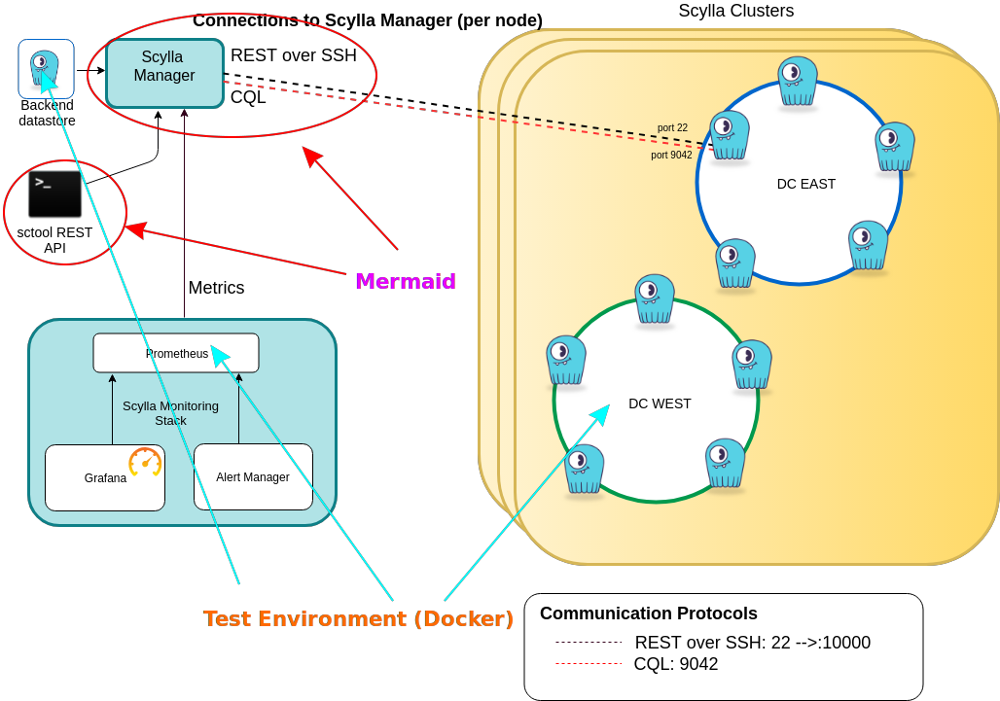

# Scylla Manager

Mermaid repository provides tools for managing clusters of Scylla servers. It consists of two main components:

- `scylla-manager`, server that manages Scylla clusters,
- `sctool`, CLI interface to the `scylla-manager` server.

## Setting up development environment

Install Docker and Go.

Make sure that `GOPATH` environment variable is properly set and that `GOPATH/bin` is under `PATH` before running this because following command will try to setup required tools based on those variables:

```bash
make setup setup-dev
```

## Running a development server and sctool



Let's start the test cluster.
Docker compose environment for test cluster is located in the `testing` directory.
Let's build the Scylla node image first.

```bash
cd testing
make build
```

This will build the image that is going to be used for every node in the test cluster.
Now let's start the cluster:

```bash
make up
```

This will run `./docker-compose` from the current directory and bring up six ScyllaDB nodes along with one `Prometheus` node and one Scylla database node that is used by the `scylla-manager` to store metadata about the clusters.

```
# Check the status of the cluster
make status

Datacenter: dc1
===============
Status=Up/Down
|/ State=Normal/Leaving/Joining/Moving
--  Address         Load       Tokens       Owns    Host ID                               Rack
UN  192.168.100.11  1.98 MB    256          ?       c50e6a9e-9bfa-4f68-ab66-0308bd9249e0  rack1
UN  192.168.100.12  1.99 MB    256          ?       a447fa2f-a510-485b-bf0f-9aafcfbbaf0c  rack1
UN  192.168.100.13  1.99 MB    256          ?       11537dbf-220d-4051-96e1-d30276309085  rack1
Datacenter: dc2
===============
Status=Up/Down
|/ State=Normal/Leaving/Joining/Moving
--  Address         Load       Tokens       Owns    Host ID                               Rack
UN  192.168.100.21  1.98 MB    256          ?       69c3ef9e-b8b1-41b3-8878-72c35de00dcc  rack1
UN  192.168.100.22  1.98 MB    256          ?       7176f302-9614-4769-820d-b3b32cc52ad2  rack1
UN  192.168.100.23  1.99 MB    256          ?       fae327fa-f157-48c6-bbbc-98169b8a65bb  rack1

Note: Non-system keyspaces don't have the same replication settings, effective ownership information is meaningless
```

```
docker ps

CONTAINER ID        IMAGE                       COMMAND                  CREATED             STATUS              PORTS                                                    NAMES
4a2908be0548        scylladb/scylla-ssh:2.3.0   "/docker-entrypoint.…"   2 hours ago         Up 2 hours          7000-7001/tcp, 9042/tcp, 9160/tcp, 9180/tcp, 10000/tcp   mermaid_dc1_node_3_1
ef8dd5b68763        scylladb/scylla-ssh:2.3.0   "/docker-entrypoint.…"   2 hours ago         Up 2 hours          7000-7001/tcp, 9042/tcp, 9160/tcp, 9180/tcp, 10000/tcp   mermaid_dc2_node_1_1
1a20e308c82b        scylladb/scylla-ssh:2.3.0   "/docker-entrypoint.…"   2 hours ago         Up 2 hours          7000-7001/tcp, 9042/tcp, 9160/tcp, 9180/tcp, 10000/tcp   mermaid_dc1_node_2_1
3b8172c18146        prom/prometheus             "/bin/prometheus --c…"   2 hours ago         Up 2 hours                                                                   mermaid_prometheus_1
093c9e54c388        scylladb/scylla:2.3.0       "/docker-entrypoint.…"   2 hours ago         Up 2 hours          7000-7001/tcp, 9042/tcp, 9160/tcp, 9180/tcp, 10000/tcp   mermaid_scylla-manager-db_1
3292046031d5        scylladb/scylla-ssh:2.3.0   "/docker-entrypoint.…"   2 hours ago         Up 2 hours          7000-7001/tcp, 9042/tcp, 9160/tcp, 9180/tcp, 10000/tcp   mermaid_dc2_node_3_1
eb8e19c04d97        scylladb/scylla-ssh:2.3.0   "/docker-entrypoint.…"   2 hours ago         Up 2 hours          7000-7001/tcp, 9042/tcp, 9160/tcp, 9180/tcp, 10000/tcp   mermaid_dc2_node_2_1
08e9a46112e2        scylladb/scylla-ssh:2.3.0   "/docker-entrypoint.…"   2 hours ago         Up 2 hours          7000-7001/tcp, 9042/tcp, 9160/tcp, 9180/tcp, 10000/tcp   mermaid_dc1_node_1_1

```

Open new terminal window to build and start `scylla-manager` development server:

```bash
# From the root of the project.
make dev-server
```

This will start outputting `scylla-manager` logs. In another terminal window compile `sctool` development client:

```bash
# From the root of the project.
make dev-cli
```

Once `scylla-manager` is bootstrapped use `sctool` to add information about the cluster to the manager:

```bash
./sctool cluster add --host=192.168.100.11 --ssh-user=scylla-manager --ssh-identity-file=~/.ssh/scylla-manager.pem
```

Then ask `scylla-manager` to give the status of the cluster:

```bash
./sctool status -c cluster1
```

If everything worked correctly you should see the output similar to [this](https://docs.scylladb.com/operating-scylla/manager/latest/sctool/#status).

## Running tests

If test environment is running correctly you can run tests with:

```bash
make test
```

This runs both unit and integration tests.
You can run them separately with:

```bash
make unit-test
# and
make integration-test
```

Project testing heavily depends on integration tests, which are slow.
Tests should run for couple of minutes. All tests should succeed.

## Extending HTTP clients

There are two HTTP APIs that are specified with Swagger format, the API of the Scylla node and the API of the `scylla-manager` itself.

Client implementations are separated into packages:

- `scyllaclient` which contains client for the Scylla API along with Swagger specification file `scylla-api.json` and,
- `mermaidclient` which contains client for the `scylla-manager` API along with Swagger specification file `mermaid-api.json`.

Both clients are generated automatically by shell scripts.
To refresh generated packages from Swagger specification run:

```bash
make generate

# Or for generating specific client package

go generate ./mermaidclient
go generate ./scyllaclient
```

## Sending patches

Develop on dedicated branch rooted at master.
Pull master regularly and rebase your work upon master whenever your dev branch is behind.
You are allowed and required to force push to your branches to keep the history neat and clean.

Document your work in commit messages.
Explain why you made the changes and mention IDs of the affected issues on Github.

Before pushing please run `make check` and `make test` to make sure all tests pass.

When satisfied create a pull request onto master.
All pull requests have to go trough review process before they are merged.
