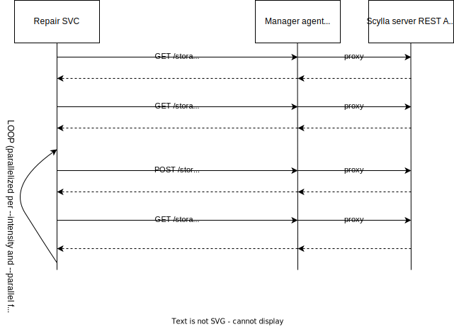

# Repair service

### Useful links

- Official documentation of what the repair in scylla-manager is https://manager.docs.scylladb.com/stable/repair/
- `sctool repair` command https://manager.docs.scylladb.com/stable/sctool/repair.html
- Why to repair Scylla https://scylladb.medium.com/scylla-manager-repair-and-tombstones-65de956098c0
- Design doc (2023) https://docs.google.com/document/d/1mBaufbomXU6hDO_25KkhC7CO65AbFgKpHVpB5Mei8xA/edit#heading=h.o646d4880ftd
- Scylla manager config file (look for `Repair service configuration`) - https://manager.docs.scylladb.com/stable/config/scylla-manager-config.html


### General description

Scylla-manager repair service is responsible for orchestrating the ScyllaDB repair procedure.<br/>
Algorithm is built around few ScyllaDB REST API endpoints.

- **[GET /storage_service/describe_ring/{keyspace}](https://github.com/scylladb/scylla-manager/blob/1819fae5419dc86aa1f071294adbd87e9c82ad4b/swagger/scylla_v1.json#L9634-L9672)**<br/>
  It returns the list of keyspace token ring. Please go through the following document https://opensource.docs.scylladb.com/stable/architecture/ringarchitecture/index.html to understand the ScyllaDB ring architecture.<br/><br/>
- **[GET /storage_service/active_repair](https://github.com/scylladb/scylla-manager/blob/1819fae5419dc86aa1f071294adbd87e9c82ad4b/swagger/scylla_v1.json#L10297-L10328)**<br/>
  This endpoint checks if there is any ongoing repair on the cluster.<br/><br/>
- **[POST /storage_service/repair_async/{keyspace}](https://github.com/scylladb/scylla-manager/blob/1819fae5419dc86aa1f071294adbd87e9c82ad4b/swagger/scylla_v1.json#L10329-L10441)**<br/>
  Triggers the repair of chosen token ranges.<br/><br/>
- **[GET /storage_service/repair_status](https://github.com/scylladb/scylla-manager/blob/1819fae5419dc86aa1f071294adbd87e9c82ad4b/swagger/scylla_v1.json#L10487-L10531)**<br/>
  It returns the status of asynchronous repair job happening on the node. The call returns when the repair is done.<br/><br/>
- **[GET /storage_service/repair_async/{keyspace}](https://github.com/scylladb/scylla-manager/blob/1819fae5419dc86aa1f071294adbd87e9c82ad4b/swagger/scylla_v1.json#L10442-L10486)**<br/>
  It returns the status of asynchronous repair job. Check is done async way and requires polling when waiting for repair job to finish.<br/><br/>



#### Performing the repair ####

```go
func NewService(session gocqlx.Session, config Config, metrics metrics.RepairMetrics, scyllaClient scyllaclient.ProviderFunc, logger log.Logger) (*Service, error)
```

Entrypoint to the service that starts the repair is 
```go
func (s *Service) Repair(ctx context.Context, clusterID, taskID, runID uuid.UUID, target Target) error {
```

`target.Target` defines the repair. It contains information about what to repair, how to parallelize, what intensity to use.<br/>

```go
func (s *Service) GetTarget(ctx context.Context, clusterID uuid.UUID, properties json.RawMessage)
```

Target is built out of `scheduler_task` properties. Properties that are missing in the database are set to default values. <br/>
Example of `scheduler_task` properties of repair task:
```
cqlsh:scylla_manager> select blobAsText(properties) from scylla_manager.scheduler_task where cluster_id = 934cec6c-b279-4c2a-acc1-ca3b150e1753 and type='repair';

 system.blobastext(properties)
-------------------------------------
  {"keyspace":["test_keyspace"]}

(1 rows)
```