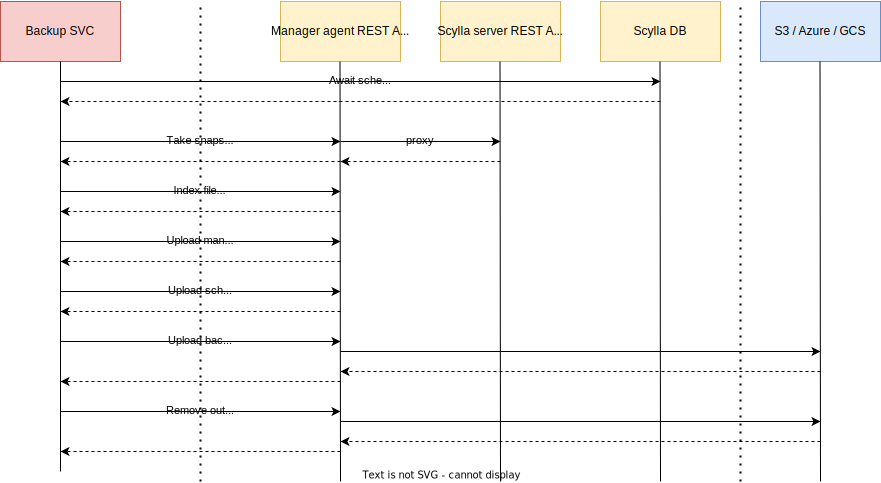

# Backup service

### Useful links
- Official documentation of what the backup in scylla-manager is - https://manager.docs.scylladb.com/stable/backup/index.html
- `sctool backup` command - https://manager.docs.scylladb.com/stable/sctool/backup.html
- Scylla manager agent config file (look for `Backup general configuration.`) - https://manager.docs.scylladb.com/stable/config/scylla-manager-agent-config.html
- Scylla manager config file (look for `Backup service configuration`) - https://manager.docs.scylladb.com/stable/config/scylla-manager-config.html

#### Performing the backup ####

```go
func NewService(session gocqlx.Session, config Config, metrics metrics.BackupMetrics, clusterName ClusterNameFunc, scyllaClient scyllaclient.ProviderFunc,
	clusterSession SessionFunc, logger log.Logger,
) (*Service, error)
```


Entrypoint on the backup service that starts the process of backing up the data is
```go
func (s *Service) Backup(ctx context.Context, clusterID, taskID, runID uuid.UUID, target Target) error
```

`target.Target` defines the backup. It contains information about what to backup, where to backup, what is the retention policy, what paralellism must be used and how to rate limit.<br/>

```go
func (s *Service) GetTarget(ctx context.Context, clusterID uuid.UUID, properties json.RawMessage)
```

Target is built out of `scheduler_task` properties. Properties that are missing in the database are set to default values. <br/>
Example of `scheduler_task` properties of backup task:
```
cqlsh> select blobAsText(properties) from scylla_manager.scheduler_task where cluster_id=749e3aef-3dd3-4b6c-af86-2fc466edbaa8 and type='backup';

 system.blobastext(properties)
-------------------------------------
 {"location":["s3:backuptest-smoke"]}

(1 rows)
```



- **Backup SVC** is part of scylla-manager-server
- **Manager agent REST API** is the REST API exposed by Scylla Manager Agent, it proxies request to Scylla server REST API as well. It's a part of `scylla-manager-agent.service`
- **Scyll server REST API** is a part of `scylla-server.service` 
- **Scylla DB** is part of `scylla-server.service`. Shown on the diagram to distinguish REST calls from CQL calls.
- **S3 / Azure / GCS** is a backup location

Backup service updates the task progress frequently to `backup_run_progress` table of scylla-manager database.
Diagram is simplified as it shows interaction with one scylla node only. All the steps are parallelized between different nodes.

Please check https://manager.docs.scylladb.com/stable/backup/specification.html for a backup directory layout and manifest file specification.