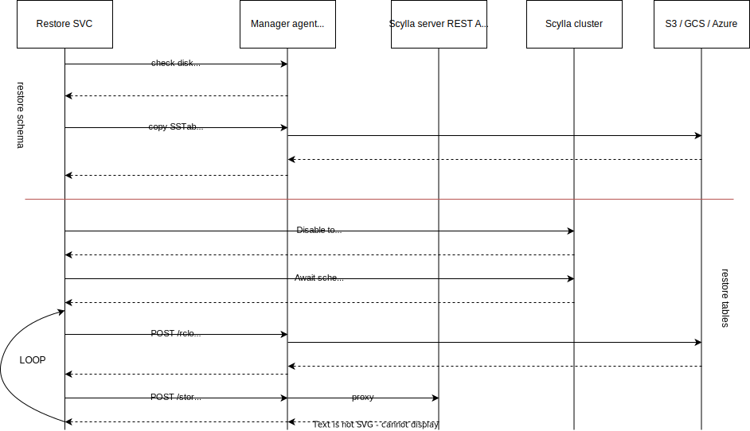

# Restore service

### Useful links
- Official documentation of what the restore in scylla-manager is - https://manager.docs.scylladb.com/stable/restore/
- `sctool restore` command - https://manager.docs.scylladb.com/stable/sctool/restore.html
- Load&Stream - https://opensource.docs.scylladb.com/stable/operating-scylla/nodetool-commands/refresh.html#load-and-stream

#### Performing the restore ####

```go
func NewService(session gocqlx.Session, config Config, metrics metrics.BackupMetrics, clusterName ClusterNameFunc, scyllaClient scyllaclient.ProviderFunc,
	clusterSession SessionFunc, logger log.Logger,
) (*Service, error)
```


Entrypoint on the restore service that starts the process of restoring the data is
```go
func (s *Service) Restore(ctx context.Context, clusterID, taskID, runID uuid.UUID, target RestoreTarget) error {
```

`target.RestoreTarget` defines the restore. It contains information about what to restore and defines the mode (schema/tables).<br/>

```go
func (s *Service) GetRestoreTarget(ctx context.Context, clusterID uuid.UUID, properties json.RawMessage) (RestoreTarget, error)
```

Target is built out of `scheduler_task` properties. Properties that are missing in the database are set to default values. <br/>
Example of `scheduler_task` properties of restore task:
```
cqlsh> select blobAsText(properties) from scylla_manager.scheduler_task where cluster_id=749e3aef-3dd3-4b6c-af86-2fc466edbaa8 and type='restore';

 system.blobastext(properties)
-------------------------------------
 {"location":["s3:backuptest-smoke"]}

(1 rows)
```



- **Backup SVC** is part of scylla-manager-server
- **Manager agent REST API** is the REST API exposed by Scylla Manager Agent, it proxies request to Scylla server REST API as well. It's a part of `scylla-manager-agent.service`
- **Scyll server REST API** is a part of `scylla-server.service`
- **Scylla DB** is part of `scylla-server.service`. Shown on the diagram to distinguish REST calls from CQL calls.
- **S3 / Azure / GCS** is a backup location

Restore service updates the task progress frequently to `restore_run_progress` table of scylla-manager database.
Diagram is simplified as it shows interaction with one scylla node only. All the steps are parallelized between different nodes.
